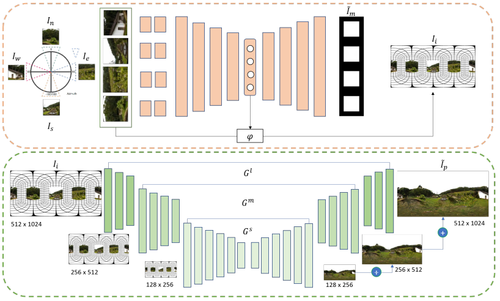
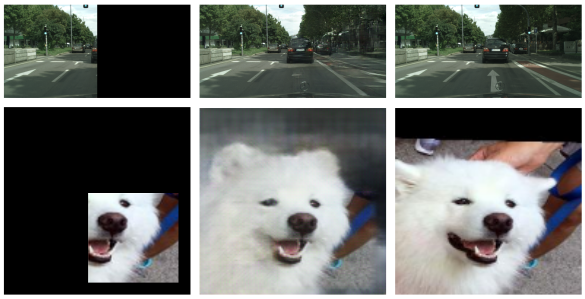

# 360_pano
360 Panorama synthesis with hierarchical network

### Introduction
Relative FOV estimation and high resolution 360 panorama synthesis based on generative hierarchical network. \
The network estimates relative fov from four input sequence then generates the partial equirectangular images. \
The equirectangular image is synthesized with hierarchical method (3 scales).



### Results
###### Equirectangular output 512 x 1024


###### Equirectangular output 128 x 256 (rectangular mask)


###### Regular output on different dataset


### Prerequisites
* Python 3.5
* PyTorch
* OpenCV

### Usage
```
TBD
```
